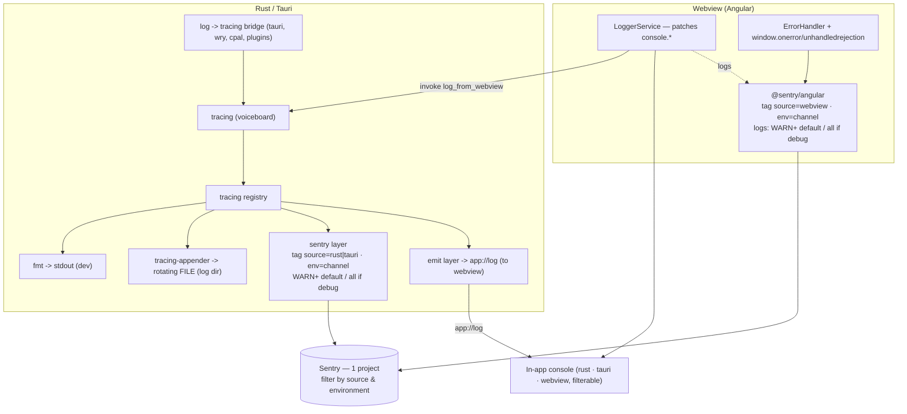

# Unified Logging & Sentry Error Reporting - Design

> **Date:** 2026-06-14
> **Status:** Ready for implementation
> **Supersedes:** parts of `2026-02-07-sentry-logs-design.md` (the debug-mode gate and
> environment handling are revised here).

## Goal

Make logs **exploitable both locally and remotely**:

- **Locally**: an in-app debug console that shows *every* log (Rust app, Tauri/framework,
  webview), plus a persistent rotating log file unifying all three sources.
- **Remotely (Sentry)**: every event/log is correctly categorized by `source`
  (`rust` / `tauri` / `webview`) and `environment` (`development` / `beta` / `production`),
  so a user's situation can be understood without machine access.

## Problem summary (current state)

The pipeline is wired but six design choices make logs unusable:

1. **Verbose logs are dropped unless debug mode is ON** (off by default), on both sides
   (`src-tauri/src/infrastructure/sentry.rs:42`, `src/main.ts:44`). The *Sentry > Logs*
   stream is effectively empty for real users — only Issues (errors/panics) appear.
2. **No source categorization.** Rust, Tauri framework and webview all report to one
   project (`.env`) with no `source` tag. Impossible to tell where an event came from.
3. **`environment` is wrong/inconsistent.** Frontend is hard-coded `"production"`
   (`src/main.ts:37`); Rust uses `cfg!(debug_assertions)` (`sentry.rs:35`); the beta/stable
   channel is never reflected in the SDK environment.
4. **The in-app console only shows audio.** It listens to `log-event` (never emitted),
   `audio-engine-log`, `audio-debug` (`debug-console.service.ts:67`). It captures neither
   frontend `console.*` nor general Rust `tracing` logs.
5. **No local log file.** Logs go only to stdout (invisible to end users) and Sentry. No
   file to request from a user; a pre-Sentry-init crash leaves no trace.
6. **Two disconnected streams.** No unified timeline (console, file) and no cross-source
   correlation in Sentry.

Secondary: `tracesSampleRate: 0` (no perf data); no PII scrubbing on Rust events.

> Note: the DSN is **not** committed — `.env` is git-ignored (`.gitignore:45`) and the DSN
> lives in the GitHub Actions secret `SENTRY_DSN` (org var `SENTRY_ORG=appins`,
> `SENTRY_PROJECT=voiceboard`).

## Decisions (agreed)

| Topic | Decision |
|-------|----------|
| **Sentry log volume** | Send **WARN + ERROR by default**; when debug mode is ON, send **everything (DEBUG+)**. Errors still create Issues. |
| **SDK architecture** | **Dual SDK**: keep `@sentry/angular` (native JS stack traces + source maps) *and* the Rust SDK. Unify the in-app console and the log file across both. |
| **Sentry separation** | **One project + tags.** Distinguish sources with a `source` tag (`rust` / `tauri` / `webview`), not separate projects. |

## Target architecture

Rust becomes the **logging hub** for local unification (file + console), while the frontend
keeps its own SDK for high-quality JS error reporting.



### Routing rules (avoid duplication & loops)

Each log has a `tracing` **target**; routing keys off it.

| Source | target | -> File | -> Sentry (Rust SDK) | -> Sentry (JS SDK) | -> emit `app://log` | -> in-app console |
|--------|--------|:------:|:--------------------:|:------------------:|:-------------------:|:-----------------:|
| Rust app | `voiceboard::*` | ✅ | ✅ `source=rust` | — | ✅ | ✅ (via emit) |
| Tauri/framework | `tauri`, `wry`, `tao`, `cpal`, plugins | ✅ | ✅ `source=tauri` | — | ✅ | ✅ (via emit) |
| Webview (forwarded) | `webview` | ✅ | ❌ (filtered out) | ✅ `source=webview` | ❌ (no echo) | ✅ (added directly by LoggerService) |

- Webview logs are **not** re-sent to Sentry from Rust (the JS SDK already does, with browser
  context + source maps) and are **not** echoed back via `app://log` (the LoggerService
  already put them in the console). They *are* written to the unified file so it contains all
  three sources interleaved.
- The Rust sentry layer's `EventFilter` returns `Ignore` for `target == "webview"`.
- The emit layer skips `target == "webview"`.

## Detailed design

### 1. Sentry taxonomy

**`source` tag (three buckets).** Derived from the log target/logger, set centrally in the
`before_send` (events) and `before_send_log` (logs) hooks:

- target starts with `voiceboard` -> `source = "rust"`
- target == `"webview"` -> `source = "webview"` (only reaches the JS SDK in practice)
- otherwise (`tauri`, `wry`, `tao`, `cpal`, plugin crates) -> `source = "tauri"`

Frontend sets `source = "webview"` once via `Sentry.setTag` / initial scope.

> Implementation note: confirm the exact field names against `sentry` 0.46 — events expose a
> `logger` field; `sentry::protocol::Log` exposes an `attributes` map. The mapping logic lives
> in one helper so both hooks share it. If per-event tagging via hooks proves awkward, fall
> back to a thin custom `tracing` Layer that injects the `source` tag into the Sentry scope
> per event before the sentry layer runs.

**`environment` (channel-aware, consistent both sides).** The running binary's channel is
fixed at build time, so resolve `environment` from a **compile-time env var** with a runtime
fallback:

- `SENTRY_ENVIRONMENT` injected by CI (`release.yml` already computes `sentry_env` =
  `beta` for `develop`, `production` for `main`).
- Fallback when unset: `cfg!(debug_assertions) ? "development" : "production"`.

Expose it to the webview via a new command `get_app_environment()` so the JS SDK uses the
exact same value instead of the hard-coded `"production"`.

**`install_id` (user grouping).** Generate a persistent UUID on first run (stored via
`tauri-plugin-store`), set as `Sentry.setUser({ id: install_id })` on both sides so all events
from one machine are grouped. No PII.

### 2. Log volume gating (revised)

Baseline = **WARN+**; debug mode unlocks **DEBUG+**. Applied identically on both sides.

Rust — `before_send_log` (`sentry.rs`):

```rust
before_send_log: Some(Arc::new(|mut log| {
    let keep = matches!(
        log.level,
        LogLevel::Warn | LogLevel::Error | LogLevel::Fatal
    ) || DEBUG_MODE_ENABLED.load(Ordering::Relaxed);
    // (set the `source` attribute here as well, see taxonomy)
    keep.then_some(log)
})),
```

Frontend — `beforeSendLog` (`main.ts`):

```ts
beforeSendLog(log) {
  if (debugModeEnabled) return log;
  return ["warn", "error", "fatal"].includes(log.level) ? log : null;
}
```

Errors continue to create Issues (Rust `EventFilter::ERROR => Event | Log`; JS ErrorHandler).

### 3. Capture completeness (Rust side)

- **Bridge `log` -> `tracing`** for framework/plugin/cpal logs. `SubscriberInitExt::init()`
  with the default `tracing-log` feature should already install `LogTracer`; verify, and if
  not, call `tracing_log::LogTracer::init()` explicitly.
- **Broaden the `EnvFilter`** so framework targets are not silently capped. Proposed default:
  `voiceboard=debug,tauri=info,wry=info,tao=warn,cpal=info,info`. Still overridable via
  `RUST_LOG`. When debug mode is ON, optionally bump framework targets to `debug` (reloadable
  filter or a second filter clause).

### 4. Local log file

- Add `tracing-appender` rolling file layer writing to the Tauri **log dir**
  (macOS: `~/Library/Logs/com.voiceboard.app/`).
- Init ordering: logging is set up in `run()` before the Tauri builder exists, so compute the
  log dir from the known bundle identifier (`com.voiceboard.app`) + per-OS conventions
  (`dirs`/`directories` crate), rather than from `app.path()`. Daily rotation, keep N files.
- Add a command `open_log_dir()` and reuse the console's existing `exportLogs()` for a
  "copy/share logs" action.

### 5. In-app console feeds (Rust -> webview)

- **Emit layer**: a custom `tracing` Layer formats each event (skipping `target == "webview"`)
  and emits `app://log` with `{ timestamp, level, source, target, message, fields }`.
- Init ordering is the same chicken-and-egg problem. Pattern: the layer pushes formatted
  records into a static channel (`mpsc`/`broadcast`) + a small bounded ring buffer. In
  `setup()`, store the `AppHandle`, drain the ring buffer (so logs emitted before the webview
  existed are replayed), then forward live records. The ring buffer also seeds the console
  when the panel is opened.
- Replace the dead `log-event` listener in `debug-console.service.ts` with an `app://log`
  listener that maps the payload (including `source` for coloring/filtering).

### 6. Webview capture (frontend)

- **`LoggerService`** that monkey-patches `console.log/info/warn/error/debug`:
  1. calls the original console (DevTools still works),
  2. pushes into the in-app console buffer (always — buffering no longer gated by debug mode;
     only the *panel visibility* and *Sentry volume* are gated),
  3. forwards to Rust via `invoke("log_from_webview", { level, message, fields })` for the
     unified file.
  - The JS SDK's `consoleLoggingIntegration` keeps sending webview logs to Sentry
    (`source=webview`), gated by the revised `beforeSendLog`.
- Keep `Sentry.createErrorHandler` + `provideBrowserGlobalErrorListeners()` for uncaught
  errors / unhandled rejections (already present, `app.config.ts`).
- Guard against feedback loops: the LoggerService must not log inside its own patched
  console path, and `log_from_webview` failures must be swallowed silently.

### 7. Console UI

Extend `debug-console.component.ts`: per-source color/badge (`rust` / `tauri` / `webview`),
level filter, text search, and source filter. Always buffer (cap `MAX_LOGS`, already 500 —
consider raising). The panel open/close stays user-controlled; debug mode no longer hides the
captured logs, only controls verbose Sentry volume.

## Implementation plan (phased)

Each phase is independently shippable and testable.

- **Phase 1 — Sentry taxonomy & gating (highest value, lowest risk).**
  - Rust: `source` tag derivation, `environment` from `SENTRY_ENVIRONMENT`, WARN+ gating,
    `install_id` user.
  - Frontend: `source=webview` tag, `environment` from `get_app_environment`, WARN+ gating,
    `install_id`.
  - CI: inject `SENTRY_ENVIRONMENT` in `release.yml` build step.
- **Phase 2 — Capture completeness.** `log->tracing` bridge verification, broadened
  `EnvFilter`.
- **Phase 3 — Local file.** `tracing-appender` rolling file, log-dir helper, `open_log_dir`.
- **Phase 4 — Unified in-app console.** Rust emit layer + `app://log`; frontend
  `LoggerService` (console patch + forward); replace dead `log-event` listener; UI filters.
- **Phase 5 — Polish.** Console source filters/search, raise buffer, optional
  `tracesSampleRate`.

## Testing strategy

- **Rust unit tests**: `source` derivation from target; `environment` resolution
  (compile-time vs fallback); `before_send_log` gating truth table (off: WARN/ERROR kept,
  INFO/DEBUG dropped; on: all kept).
- **Rust**: log-dir helper returns correct per-OS path for `com.voiceboard.app`.
- **Frontend unit tests**: `beforeSendLog` gating truth table; `LoggerService` patches
  console without recursion and forwards once; `app://log` payload mapping.
- **Manual/integration**: toggle debug mode and verify (a) console shows rust+tauri+webview,
  (b) file contains all three, (c) Sentry receives WARN+ with correct `source`/`environment`,
  (d) DEBUG/INFO appear in Sentry only when debug mode ON.

## Files changed

| File | Change |
|------|--------|
| `src-tauri/Cargo.toml` | add `tracing-appender`, `directories`/`dirs`, `uuid`; confirm `tracing-log` |
| `src-tauri/src/infrastructure/sentry.rs` | `source` tag, `environment` from env, WARN+ gating, `install_id` |
| `src-tauri/src/infrastructure/logging.rs` | broaden `EnvFilter`, add file layer + emit layer, `webview` target -> `Ignore` |
| `src-tauri/src/infrastructure/mod.rs` | export new helpers (log dir, emit channel) |
| `src-tauri/src/application/commands.rs` | `log_from_webview`, `get_app_environment`, `open_log_dir` |
| `src-tauri/src/lib.rs` | set `AppHandle` for emit layer, flush ring buffer, init `install_id` |
| `.github/workflows/release.yml` | inject `SENTRY_ENVIRONMENT` (beta/production) into build |
| `src/main.ts` | `environment` from command, `source=webview`, revised `beforeSendLog`, `install_id` |
| `src/app/core/services/logger.service.ts` | **new** — console patch + forward to Rust + buffer |
| `src/app/core/services/debug-console.service.ts` | listen to `app://log`, always buffer, source field |
| `src/app/core/components/debug-console/debug-console.component.ts` | source badges, filters, search |

## Risks & open questions

- **Init ordering** (logging before Tauri app exists) is the main complexity for the file and
  emit layers; the static-channel + ring-buffer pattern resolves it but needs care.
- **Sentry 0.46 API**: confirm exact field for per-event/per-log `source` tagging; fall back
  to a custom layer if hooks are insufficient.
- **Volume**: WARN+ baseline is modest, but verify no hot path logs WARN frequently (audio
  callbacks). Audit `tracing::warn!` sites before shipping.
- **Webview forward volume**: every `console.*` becomes an `invoke`; batch or debounce if it
  proves chatty.
